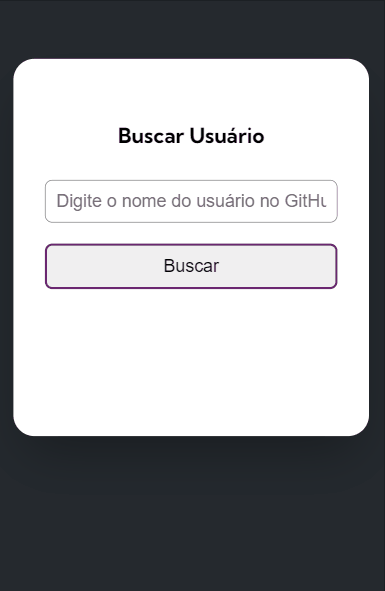
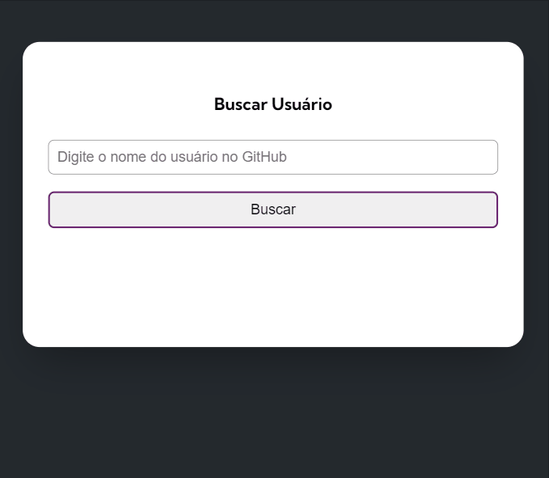
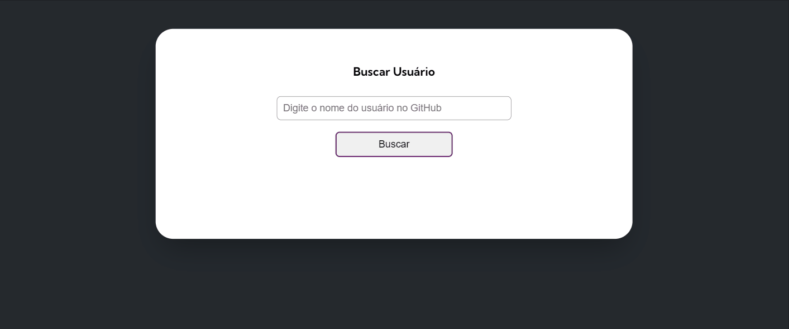

# API-Github

Este desafio faz parte do módulo de Javascript avançado, dentro do curso [Dev Quest](https://dev-em-dobro.ticto.club/).

## Do que se trata esse desafio?
Trata-se de uma página de busca de usuários do github. 
Essa busca é feita através de uma requisição a [API DO GITHUB](https://docs.github.com/pt/rest/repos/repos?apiVersion=2022-11-28#list-repositories-for-a-user)
usando o método fetch.

## Quais interações são feitas?
- Ao inserir o nome do usuário do github, é apresentado na tela dados como: 
  Imagem do usuário,nome,bio,quantidade de seguidores e quantidade de pessoas que este usuário segue.
  
- Também são mostrados dados dos últimos dez repositórios do usuário, tais como:
  Nome do repositório, quantidade de: estrelas, forks, watchers e linguagem utilizada.
  
- Também são mostradas as últimas dez atividades do usuário :
  Atividade em qual repositório e a mensagem do evento.

- Caso o usuário tente buscar sem preencher o campo do nome do usuário, um alerta é mostrado na tela.
- Caso o usuário do github pesquisado não tenha nome e/ou bio cadastrada,é informado através de uma mensagem na tela.
  
## Habilidades desenvolvidas:
- Uso de flexbox para ajustes dos elementos na tela.
- Uso e manipulação dos elementos no JavaScript através do DOM.
- Uso e manipulação dos métodos Fetch e Json para interação com a API.
- Uso dos métodos filter e map para manipulação de arrays.
- Uso de interpolação de strings para apresentação dos elementos na tela através do JS.
- Uso de funções assíncronas, eventos como addEventListener.
- Uso de mediaqueries para responsividade.

## Linguagens Utilizadas:
- HTML 

- CSS  

- JAVASCRIPT  
          

## Veja como ficou:

### Mobile:

### Tablet:

### Desktop:

Para ver o projeto pronto, [CLIQUE AQUI!](https://jessica-os.github.io/API-Github/target="_blank")
